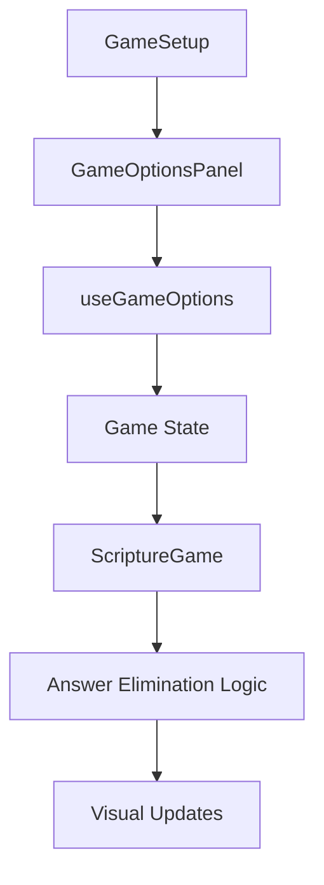

# Design Document

## Overview

The Game Options feature adds configurable gameplay mechanics to the Doctrinal Mastery Game, with the primary focus on implementing dynamic answer elimination. This feature integrates seamlessly with the existing Vue 3 + TypeScript architecture, extending the current game logic without disrupting core functionality.

The design follows the existing patterns in the codebase:

- Reactive state management using Vue's Composition API
- Component-based architecture with clear separation of concerns
- Consistent styling with Tailwind CSS
- Integration with the existing `useGameLogic` composable

## Architecture

### Component Structure

```
src/
├── components/
│   ├── GameSetup.vue (modified)
│   ├── ScriptureGame.vue (modified)
│   └── GameOptionsPanel.vue (new)
├── composables/
│   ├── useGameLogic.js (modified)
│   └── useGameOptions.js (new)
└── types/
    └── gameOptions.ts (new)
```

### State Management Flow



## Components and Interfaces

### GameOptionsPanel Component

A new component that provides the configuration interface for game options.

**Props:**

- `modelValue: GameOptions` - Current game options configuration
- `disabled: boolean` - Whether options can be modified

**Events:**

- `update:modelValue` - Emitted when options change

**Features:**

- Toggle switches for enabling/disabling options
- Slider controls for timing configurations
- Dropdown selectors for elimination behavior
- Real-time preview of settings

### Modified GameSetup Component

**Enhancements:**

- Integrates GameOptionsPanel component
- Persists game options in session storage
- Validates option combinations before game start

### Modified ScriptureGame Component

**Enhancements:**

- Displays active game options indicators
- Shows elimination countdown/progress
- Handles answer elimination animations
- Provides visual warnings before elimination

### useGameOptions Composable

**State:**

```typescript
interface GameOptions {
  answerElimination: {
    enabled: boolean;
    intervalSeconds: number; // 3, 5, 10
    eliminateToCount: number; // 2, 3, or number of remaining
    showWarning: boolean;
  };
  // Extensible for future options
}
```

**Methods:**

- `initializeOptions()` - Set default options
- `validateOptions()` - Ensure valid configuration
- `startElimination()` - Begin elimination timer
- `stopElimination()` - Cancel elimination timer
- `eliminateAnswer()` - Remove random incorrect answer

## Data Models

### GameOptions Interface

```typescript
interface GameOptions {
  answerElimination: AnswerEliminationOptions;
}

interface AnswerEliminationOptions {
  enabled: boolean;
  intervalSeconds: 3 | 5 | 10;
  eliminateToCount: 2 | 3 | number;
  showWarning: boolean;
}

interface EliminationState {
  isActive: boolean;
  timerId: number | null;
  nextEliminationTime: number;
  eliminatedAnswers: string[];
  availableForElimination: string[];
}
```

### Integration with Existing State

The game options will be integrated into the existing game state structure:

```javascript
// Added to useGameLogic composable
const gameOptions = ref({
  answerElimination: {
    enabled: false,
    intervalSeconds: 5,
    eliminateToCount: 2,
    showWarning: true,
  },
});

const eliminationState = ref({
  isActive: false,
  timerId: null,
  nextEliminationTime: 0,
  eliminatedAnswers: [],
  availableForElimination: [],
});
```

## Error Handling

### Validation Rules

1. **Elimination Count Validation:**

   - Must leave at least 2 answers remaining
   - Cannot eliminate more answers than available incorrect answers
   - Must be less than total available answers

2. **Timer Management:**

   - Clear existing timers when starting new elimination
   - Handle component unmounting gracefully
   - Prevent memory leaks from abandoned timers

3. **State Consistency:**
   - Ensure elimination state resets between questions
   - Handle mid-game option changes safely
   - Validate answer availability before elimination

### Error Recovery

- Invalid configurations show user-friendly error messages
- Fallback to default settings if saved options are corrupted
- Graceful degradation when elimination fails

## Testing Strategy

### Unit Tests (Optional)

- `useGameOptions.test.js` - Test composable logic
- `GameOptionsPanel.test.vue` - Test component behavior
- Validation function tests
- Timer management tests

### Integration Tests (Optional)

- End-to-end elimination flow
- Option persistence across sessions
- Mid-game option changes
- Error handling scenarios

### Manual Testing Scenarios

1. **Basic Elimination Flow:**

   - Enable answer elimination
   - Start game and verify elimination occurs
   - Confirm correct visual feedback

2. **Configuration Validation:**

   - Test invalid elimination counts
   - Verify error messages display
   - Ensure game cannot start with invalid config

3. **Mid-Game Changes:**

   - Change options during active game
   - Verify changes apply to next question
   - Test disabling elimination mid-question

4. **Edge Cases:**
   - Questions with only 2 answers
   - Rapid answer selection before elimination
   - Browser refresh during elimination

## Implementation Phases

### Phase 1: Core Infrastructure

- Create GameOptions types and interfaces
- Implement useGameOptions composable
- Add basic option persistence

### Phase 2: UI Components

- Build GameOptionsPanel component
- Integrate with GameSetup
- Add visual indicators to ScriptureGame

### Phase 3: Elimination Logic

- Implement answer elimination algorithm
- Add timer management
- Create elimination animations

### Phase 4: Polish and Testing

- Add visual warnings and feedback
- Implement error handling
- Conduct thorough testing

## Visual Design

### Game Options Panel

- Consistent with existing backdrop-blur styling
- Toggle switches using Tailwind's form controls
- Slider components for timing selection
- Color-coded indicators for different option types

### In-Game Indicators

- Subtle countdown timer in corner of game area
- Progress bar showing elimination timeline
- Gentle pulse animation on answers about to be eliminated
- Smooth fade-out animation for eliminated answers

### Color Scheme

- Primary: Purple/blue gradient (consistent with existing theme)
- Success: Green for enabled options
- Warning: Yellow for elimination warnings
- Error: Red for invalid configurations

## Performance Considerations

### Timer Management

- Use `requestAnimationFrame` for smooth countdown animations
- Implement efficient cleanup of timers
- Minimize DOM updates during elimination

### Memory Usage

- Clear eliminated answers from memory
- Avoid memory leaks from event listeners
- Efficient state updates using Vue's reactivity

### Accessibility

- Screen reader announcements for eliminations
- Keyboard navigation for option controls
- High contrast mode support
- Focus management during elimination

## Future Extensibility

The architecture is designed to easily accommodate additional game options:

### Potential Future Options

1. **Time Pressure Mode:** Questions have time limits
2. **Hint System:** Gradual revelation of clues
3. **Difficulty Scaling:** Adjust based on team performance
4. **Bonus Rounds:** Special question types
5. **Team Handicaps:** Balance gameplay for mixed skill levels

### Extension Points

- `GameOptions` interface can be extended with new option categories
- `useGameOptions` composable can be enhanced with new logic
- `GameOptionsPanel` can accommodate new UI controls
- Event system allows for new game mechanics integration
